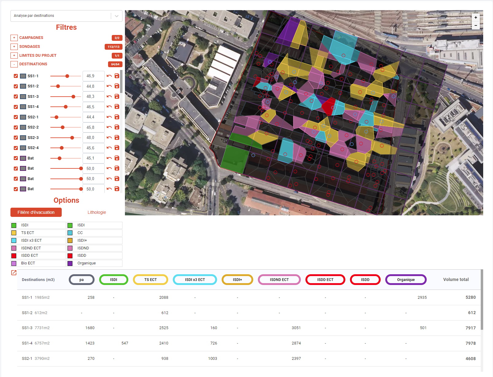
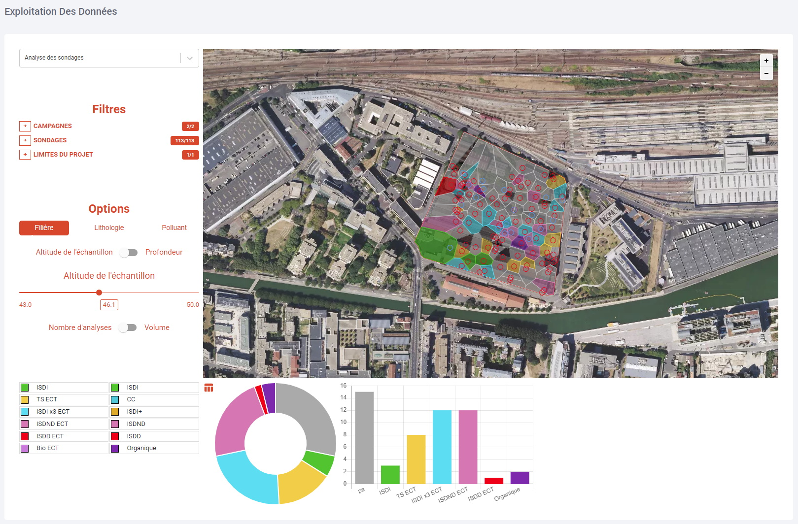
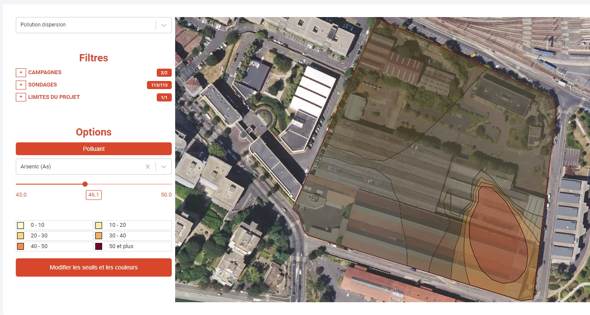

Les données de pollution récupérées par l'application Aexdo sont exploitées dans cette page.

La représentation est entièrement dynamique, en fonction de multiples critères sélectionnés par l'utilisateur qui peut retrouver des informations sur

- Les filières d'élimination
- la lithologie du terrain
- la présence et la concentration des polluants

Cette représentation est visible dans des graphiques ou dans des tables pour avoir des données précises

