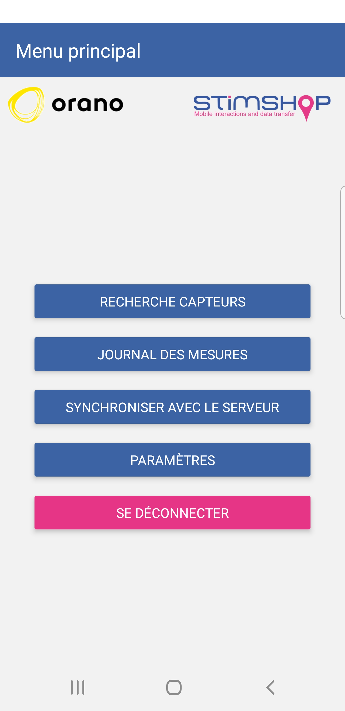
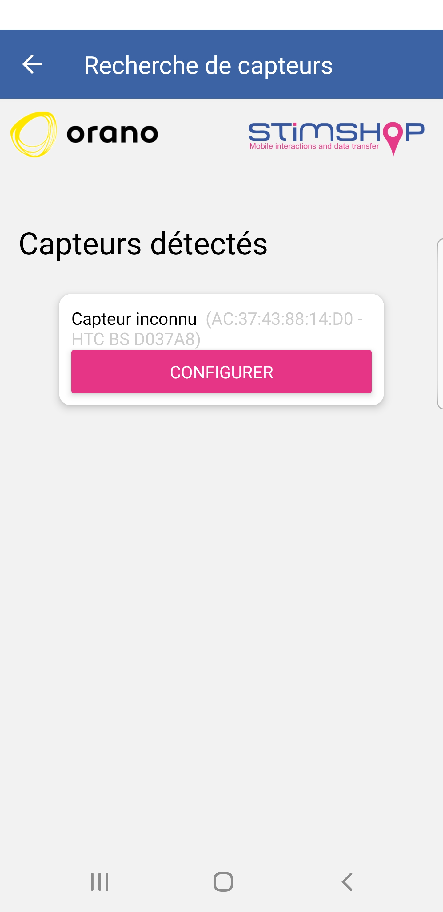
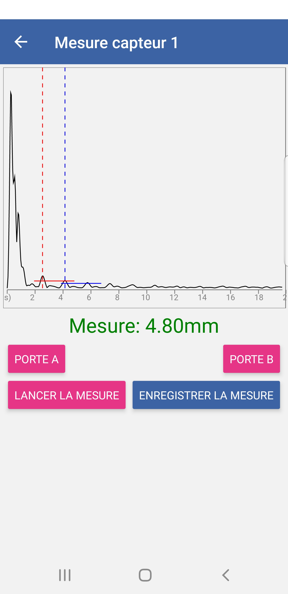
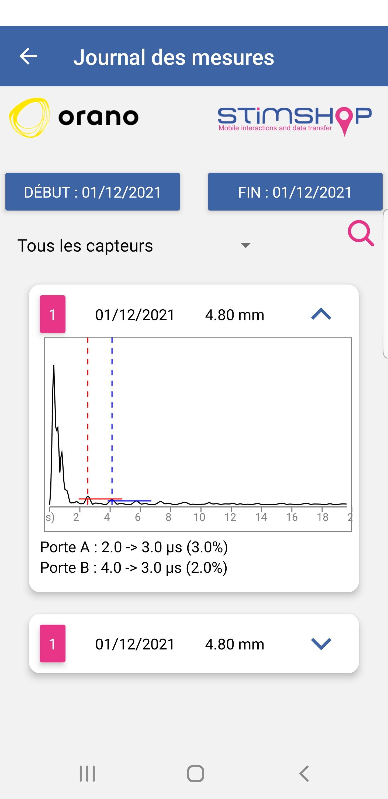
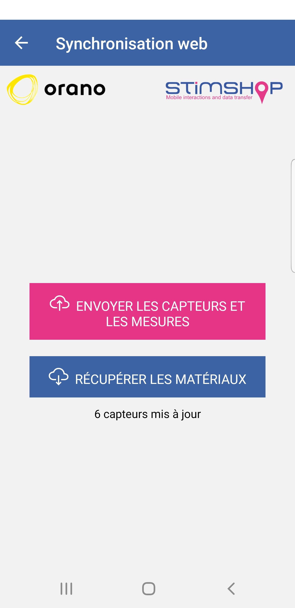

Cette application a été développée en React Native et permet de se connecter à des boitiers de mesure d'épaisseur UMIT.

Ces boitiers se connectent en bluetooth et effectuent une mesure d'épaisseur d'un tuyau ou d'un réservoir.

Les données de mesure sont envoyées à l'application qui exécute un algorithme A-Scan pour déterminer l'épaisseur mesurée.

Cette mesure et les données sont ensuite synchronisables avec le serveur UCheckIn que j'ai également développé.

