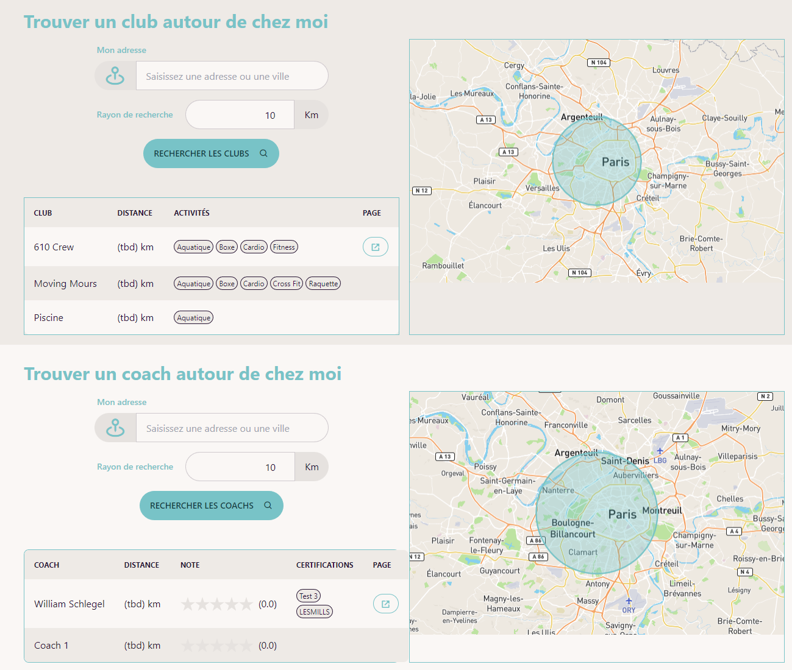
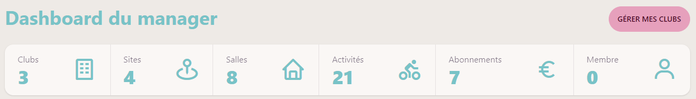
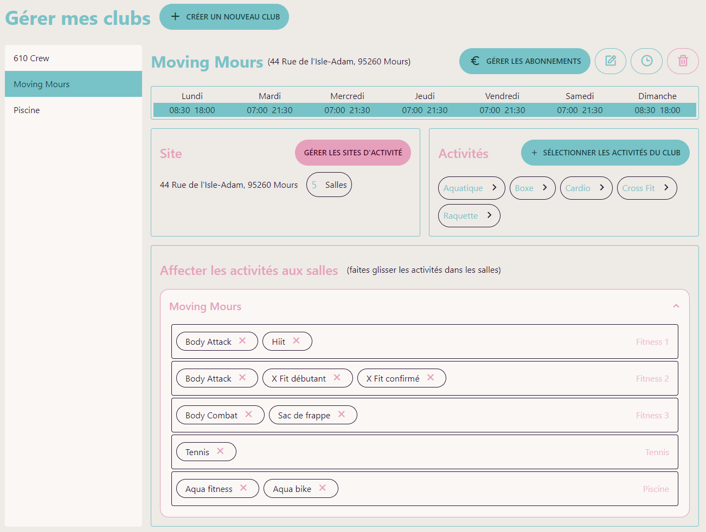
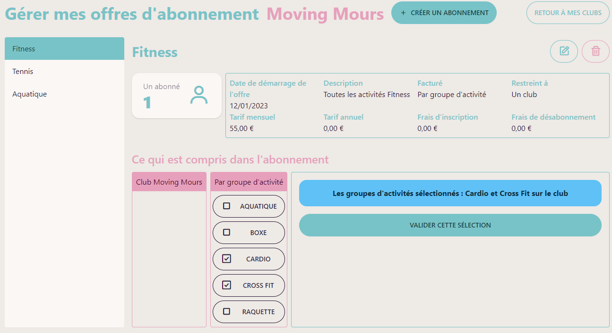
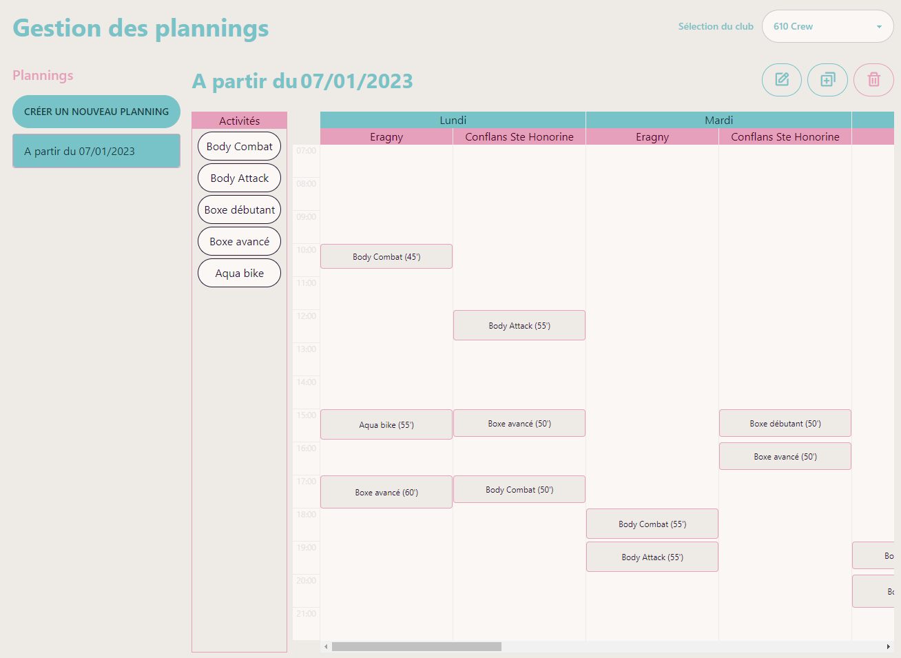
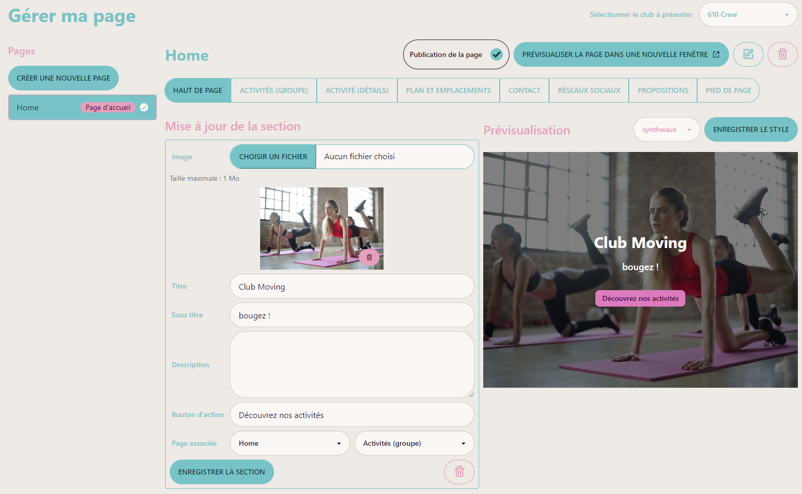
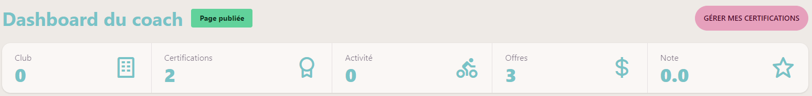
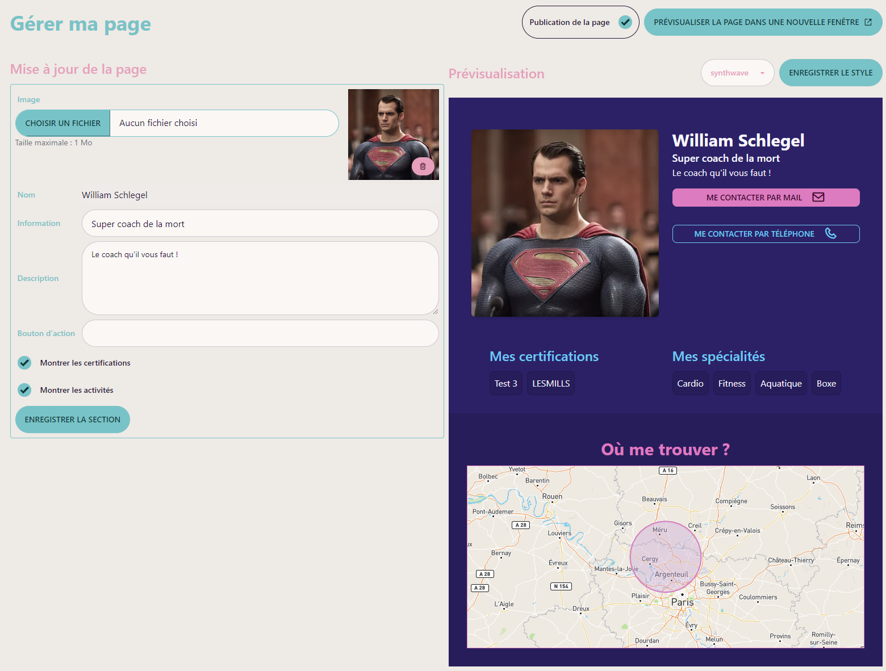
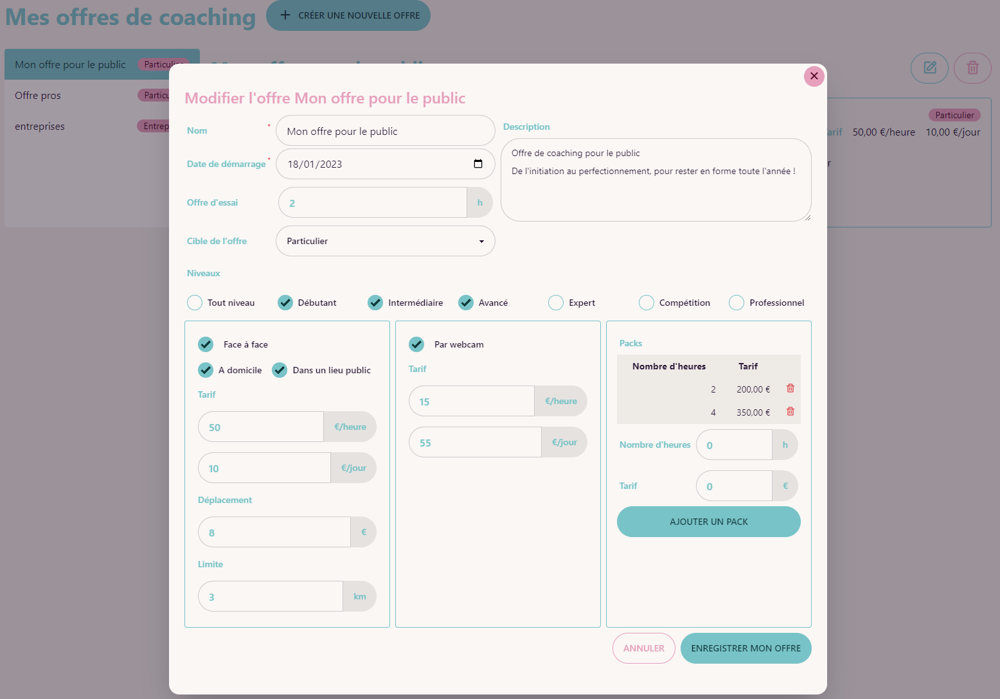
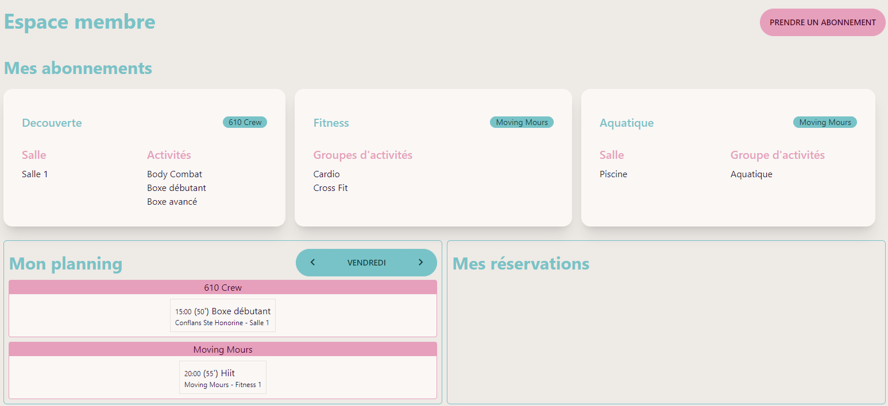

Cette application permet de gérer tous les aspects d'un club de sport et surtout apporte de la valeur à tous les intervenants.

On peut rechercher une salle ou un coach pour des cours particuliers

## Pour les managers

En tant que manager, on peut gérer son ou ses clubs avec les différents sutes d'activité, et les salles et les activités associées

Gestion des offres d'abonnements

On peut gérer les plannings pour les différentes activités

On peut créer son site vitrine pour présenter le club

Et bien d'autres choses encore...

## Pour les coachs

Les coachs gèrent leur visibilité, leur planning "club" et les rendez-vous privés

Les coachs peuvent également créer une page de présentation

Ils gèrent aussi les offres pour les coaching privés (particuliers ou entreprises)

## Pour les membres

Enfin, les membres peuvent avoir leur planning extrêmement personnalisé, en fonction des clubs ou ils sont inscrit et des abonnements qu'ils ont pris

Toute une section dédiée aux échanges, entre membres et clubs, membres et coachs, membres d'un même club ou d'une même activité est à développer, ainsi qu'un système de notation des cours et des coachs.
